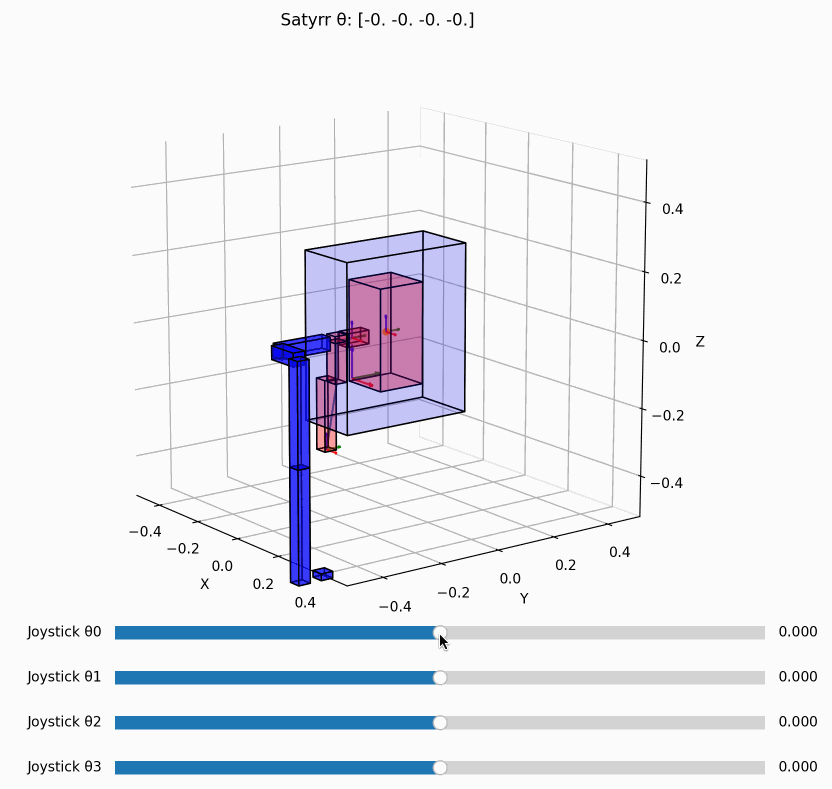

this folder has the HMI joystick forward kinematics and Satyrr robot inverse kinematics for the left arm.
The pose of the human hand is printed out to terminal in a homogeneous transformation matrix relative to the point between the right and left shoulders (center of the rectangular prisms in the visualization).

run satyrr_joystick_scale.py:

Robot in red, human in blue